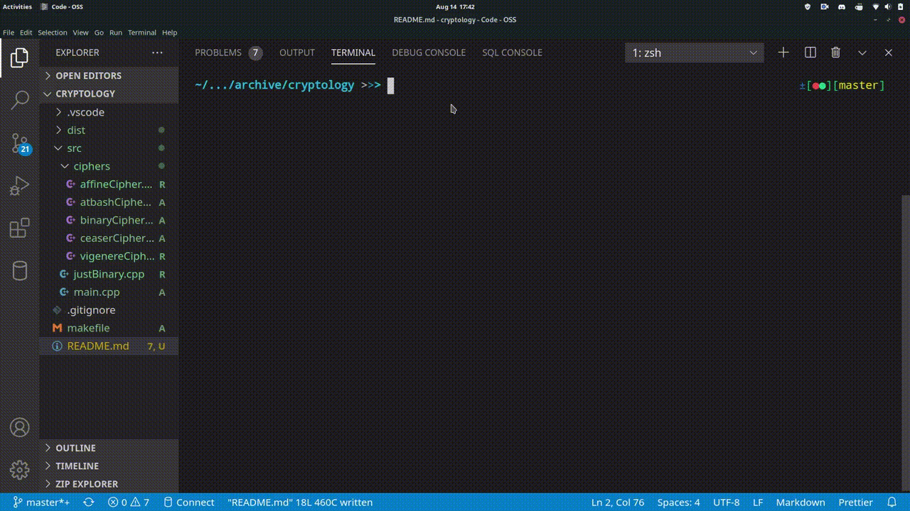

# CIPHERS APP

## DESCRIPTION

A small console app to use various implemented ciphers and data conversions.

### AFFINE CIPHER

Affine cipher takes a prime and a greater base 2 number and use it  
Affine cipher algoritm: E ( x ) = ( a x + b ) mod m  
 `Needs to be made static`

### ATBASH CIPHER

Flips the values along the range of the alphabet

### CEASER CIPHER

A rot 3 cipher currently  
Should be adapted to be rot X (any number between 0-25)  

### VIGENERE CIPHER

Work in progress

### BINARY CONVERSIONS

A wide array of binary conversions that can be statically implemented
